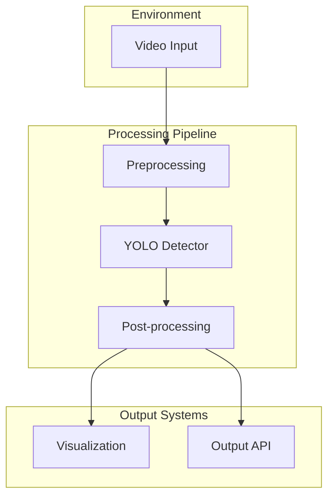
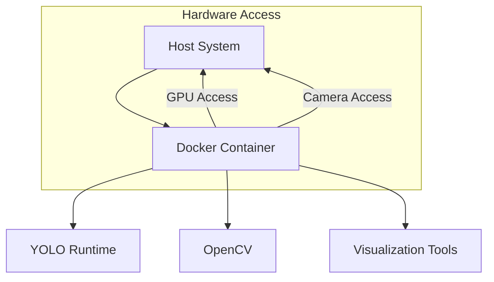

# System Patterns: Diver Detection System

## System Architecture

The diver detection system follows a modular pipeline architecture consisting of the following components:

### Component Descriptions

1. **Video Input**: 
   - Handles various input sources (video files, camera streams)
   - Abstracts input formats to provide consistent frames to the pipeline
   - Responsible for frame rate management

2. **Preprocessing**:
   - Frame resizing to match YOLO input requirements
   - Color correction for underwater conditions
   - Optional: Enhancement for poor visibility conditions

3. **YOLO Detector**:
   - YOLO model optimized for diver detection
   - Configurable inference parameters
   - Adaptable to different YOLO versions (v5, v8, etc.)

4. **Post-processing**:
   - Filtering detection results based on confidence
   - Non-maximum suppression to eliminate duplicate detections
   - Optional: Simple tracking to maintain diver IDs across frames

5. **Visualization**:
   - Real-time display of detection results
   - Bounding box rendering
   - Optional: Debugging information

6. **Output API**:
   - Standardized output format for integrations
   - Support for various logging methods
   - Event-based notification system

## Key Design Patterns

### 1. **Pipeline Pattern**
The system uses a pipeline architecture where each component processes data and passes it to the next component. This allows for:
- Independent development of each component
- Easy replacement of components
- Clear data flow

### 2. **Adapter Pattern**
Used for handling various input/output formats:
- Camera adapters for different hardware
- Output adapters for different integration needs

### 3. **Strategy Pattern**
Employed for configurable processing approaches:
- Different preprocessing strategies for different water conditions
- Multiple detection confidence thresholds

### 4. **Observer Pattern**
For notification and monitoring:
- Detection event notifications
- System status updates

## Deployment Architecture

The system is containerized using Docker, with the following structure:

### Development vs. Deployment

1. **Development Environment**:
   - Ubuntu x86 with NVIDIA GPU
   - Full debugging capabilities
   - Visualization tools enabled
   - Full model training capabilities

2. **Deployment Environment**:
   - NVIDIA Jetson platform
   - Optimized for inference only
   - Minimal dependencies
   - TensorRT optimization

## Performance Considerations

1. **Model Optimization**:
   - Model pruning for size reduction
   - Quantization for faster inference
   - TensorRT conversion for Jetson deployment

2. **Memory Management**:
   - Efficient frame buffer handling
   - Minimized copy operations
   - GPU memory management

3. **Threading Model**:
   - Input acquisition on separate thread
   - Inference on GPU thread
   - Visualization on UI thread 